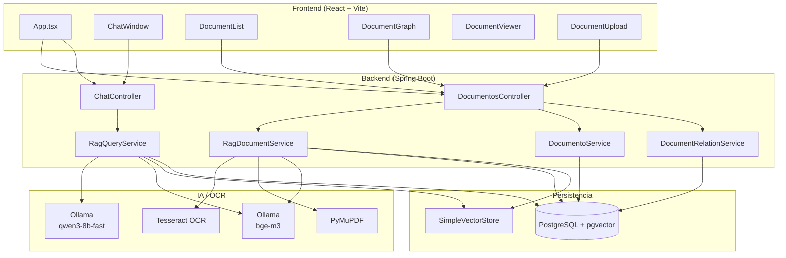
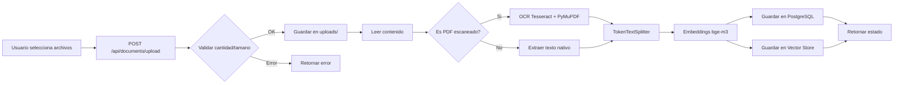
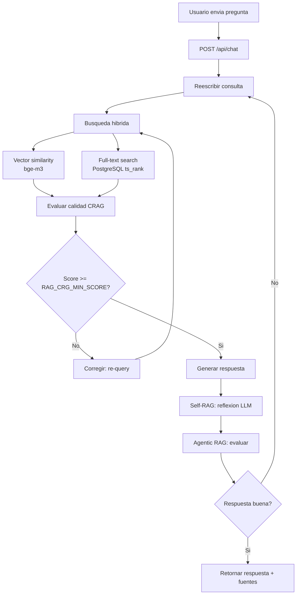
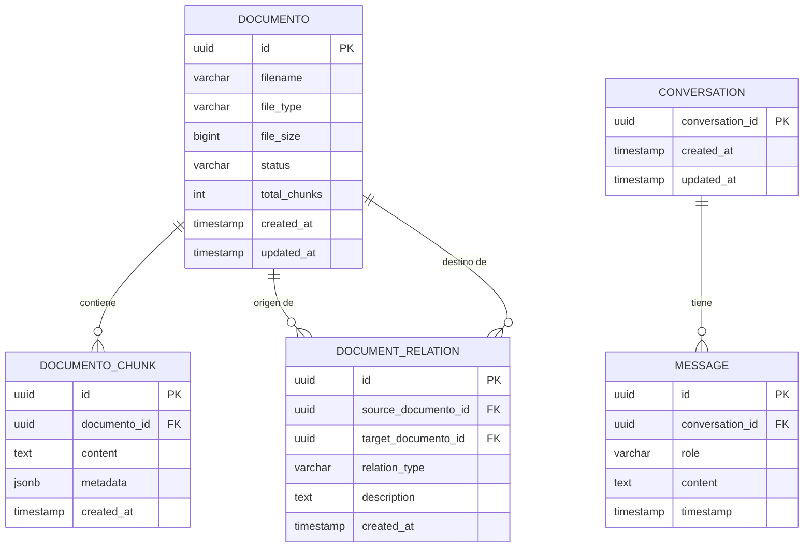

# Local RAG Assistant

> Asistente de **Retrieval-Augmented Generation (RAG)** 100% local para consultar multiples documentos mediante lenguaje natural. Proyecto de aprendizaje y portafolio desarrollado por Abel Gomez.

**Version:** `0.1.0` | **Estado:** Funcional y productivo

---

## ¿Qué es LocalRAG?

LocalRAG es una aplicacion completa de **Generacion Aumentada por Recuperacion (RAG)** que corre completamente en tu maquina. Permite cargar documentos (PDF, Word, Excel, CSV, TXT, Markdown) y hacer preguntas en lenguaje natural sobre su contenido, obteniendo respuestas generadas por un LLM local con citas a las fuentes exactas.

El sistema implementa arquitecturas RAG avanzadas:
- **RAG Lineal** - Flujo basico de busqueda y respuesta
- **CRAG (Corrective RAG)** - Evalua la calidad de la busqueda y corrige si es necesario
- **Self-RAG** - El LLM se auto-reflexiona durante la generacion
- **Agentic RAG** - Orquestacion iterativa con cambio de estrategia

Ademas incluye:
- OCR automatico para PDFs escaneados
- Busqueda hibrida (vectorial + full-text)
- Grafo de relaciones entre documentos
- Historial de conversacion persistente
- Interfaz web en espanol/ingles con tema claro/oscuro

---

## Arquitectura

### Diagrama de componentes



### Flujo: Carga de documentos



### Flujo: Consulta Chat



### Diagrama entidad-relacion



### Flujo de datos

1. **Carga de documentos** → Frontend envia archivos → Backend guarda en `uploads/` → Servicio RAG procesa
2. **Procesamiento** → Lectura → Chunking (1000 tokens, 150 overlap) → Embeddings (bge-m3) → Almacenamiento vectorial + PostgreSQL
3. **Consulta** → Pregunta del usuario → Reescritura → Busqueda hibrida → Evaluacion CRAG → Generacion Self-RAG → Respuesta con fuentes
4. **Conversacion** → Historial persistente en base de datos por sesion

---

## Stack tecnologico

| Capa | Tecnologia | Version |
|------|-----------|---------|
| **Backend** | Java 21 + Spring Boot | 3.3.4 |
| **IA/Embeddings** | Spring AI + Ollama | 1.0.0 |
| **Base de datos** | PostgreSQL + pgvector | 16+ |
| **OCR** | Tesseract 5.x + Python (PyMuPDF) | - |
| **Frontend** | React 18 + TypeScript + Vite | 6.0.3 |
| **Build Backend** | Maven | 3.9+ |
| **Build Frontend** | npm | 9+ |

### Modelos de IA

| Modelo | Proposito | Provider |
|--------|-----------|----------|
| `qwen3-8b-fast` | Generacion de respuestas (chat) | Ollama |
| `bge-m3` | Generacion de embeddings | Ollama |

---

## Caracteristicas

### Gestion de documentos
- Subida multiple de archivos (maximo 5 simultaneos)
- Formatos soportados: PDF, TXT, Markdown, DOCX, XLSX, CSV
- Procesamiento automatico con deteccion de tipo
- OCR automatico para PDFs escaneados (Tesseract + PyMuPDF)
- Chunking inteligente con TokenTextSplitter
- Almacenamiento persistente en disco y base de datos

### Busqueda y recuperacion
- Busqueda hibrida: similitud vectorial (bge-m3) + full-text search (PostgreSQL tsvector)
- Reranking de resultados por relevancia
- Top-K configurable (default: 5)
- Cita de fuentes con referencias al documento y pagina/seccion

### RAG avanzado
- **CRAG**: Evalua score promedio de similitud. Si es bajo, re-consulta o aplica correccion
- **Self-RAG**: Tokens de reflexion (`[Retrieve]`, `[IsRelevant]`, `[Support]`) durante la generacion
- **Agentic RAG**: Bucle iterativo que puede cambiar de estrategia (CRAG, Self-RAG, herramientas)

### Interfaz
- Chat conversacional con historial persistente
- Grafo interactivo de relaciones entre documentos
- Visor de documentos con previsualizacion
- Soporte multilenguaje (Espanol / Ingles)
- Tema claro / oscuro
- Indicadores de carga y estado

### Operacional
- Health check completo (app, Ollama, base de datos)
- Logs de aplicacion en `logs/application.log`
- Scripts de inicio/detencion automatica (PowerShell)
- Manejo de errores con excepciones custom

---

## Requisitos

| Requisito | Version minima | Notas |
|-----------|---------------|-------|
| Java | 21 | JDK, no solo JRE |
| Maven | 3.9+ | Backend |
| Node.js | 18+ | Frontend |
| PostgreSQL | 16+ | Con extension `pgvector` |
| Ollama | 0.1+ | Para LLM y embeddings |
| Python | 3.8+ | Opcional, solo para OCR |
| Tesseract | 5.x | Opcional, solo para OCR |
| Git | 2+ | Para clonar |

---

## Estructura del proyecto

```
LocalRAG/
├── README.md                     # Esta documentacion
├── START.md                      # Guia de inicio rapido
├── STOP.md                       # Guia de detencion
├── start-environment.ps1         # Script de inicio automatico
├── stop-environment.ps1          # Script de detencion automatica
├── backend/
│   ├── pom.xml                   # Dependencias Maven
│   ├── .env                      # Variables de entorno
│   └── src/main/
│       ├── java/com/localrag/
│       │   ├── LocalRagApplication.java
│       │   ├── controller/       # REST Controllers
│       │   ├── entity/           # Entidades JPA
│       │   ├── repository/       # Spring Data Repositories
│       │   ├── service/          # Logica de negocio
│       │   ├── rag/              # Motor RAG (core)
│       │   ├── dto/              # Data Transfer Objects
│       │   └── exception/        # Excepciones custom
│       └── resources/
│           ├── application.properties
│           └── db/migration/     # Flyway migrations
├── frontend/
│   ├── package.json
│   ├── vite.config.ts
│   └── src/
│       ├── main.tsx
│       ├── App.tsx
│       ├── context/              # Estado global (theme, i18n)
│       ├── i18n/                 # Traducciones ES/EN
│       ├── pages/                # Paginas
│       ├── components/           # Componentes UI
│       ├── api/                  # Cliente HTTP
│       └── types/                # TypeScript types
└── docs/
    └── rag-approaches.md         # Documentacion tecnica RAG
```

---

## Instalacion y configuracion

### 1. Clonar el repositorio

```bash
git clone https://github.com/abelgomez/LocalRAG.git
cd LocalRAG
```

### 2. Configurar PostgreSQL

Crear la base de datos y habilitar pgvector:

```sql
CREATE DATABASE local_rag;
CREATE EXTENSION IF NOT EXISTS vector;
```

### 3. Instalar modelos de Ollama

```bash
ollama pull qwen3-8b-fast
ollama pull bge-m3
```

### 4. Configurar variables de entorno

Backend: copiar `backend/.env` y ajustar credenciales:

```env
DATABASE_USERNAME=postgres
DATABASE_PASSWORD=tu_password
OLLAMA_BASE_URL=http://localhost:11434
OLLAMA_CHAT_MODEL=qwen3-8b-fast
OLLAMA_EMBEDDING_MODEL=bge-m3
OLLAMA_TEMPERATURE=0.2
RAG_CHUNK_SIZE=1000
RAG_CHUNK_OVERLAP=150
RAG_TOP_K=5
RAG_MAX_FILE_SIZE=50MB
RAG_OCR_ENABLED=true
RAG_CRG_MIN_SCORE=0.3
RAG_MAX_ITERATIONS=3
TESSDATA_PREFIX=C:\tesseract\tessdata
```

### 5. Iniciar la aplicacion

**Opcion A: Script automatico (recomendado)**

```powershell
.\start-environment.ps1
```

**Opcion B: Manual**

```powershell
# Terminal 1 - Backend
cd backend
mvn spring-boot:run

# Terminal 2 - Frontend
cd frontend
npm install
npm run dev
```

Acceder en: **http://localhost:5173**

---

## API Reference

### Documentos

| Metodo | Endpoint | Descripcion |
|--------|----------|-------------|
| `POST` | `/api/documents/upload` | Sube y procesa documentos (multipart, max 5 archivos) |
| `GET` | `/api/documents` | Lista todos los documentos procesados |
| `GET` | `/api/documents/{id}/content` | Obtiene el contenido textual de un documento |
| `DELETE` | `/api/documents/{id}` | Elimina un documento, sus vectores y chunks |
| `DELETE` | `/api/documents` | Elimina todos los documentos y datos relacionados |

### Relaciones entre documentos

| Metodo | Endpoint | Descripcion |
|--------|----------|-------------|
| `POST` | `/api/documents/relations` | Crea una relacion entre dos documentos |
| `GET` | `/api/documents/relations` | Lista todas las relaciones |
| `DELETE` | `/api/documents/relations/{id}` | Elimina una relacion |

### Chat

| Metodo | Endpoint | Descripcion |
|--------|----------|-------------|
| `POST` | `/api/chat` | Consulta sobre los documentos. Acepta `conversationId` para historial |
| `GET` | `/api/health` | Health check (aplicacion, Ollama, base de datos) |

---

## Base de datos

### Esquema

**Tabla: `documentos`**
| Campo | Tipo | Descripcion |
|-------|------|-------------|
| `id` | UUID | Identificador unico |
| `filename` | VARCHAR | Nombre original del archivo |
| `file_type` | VARCHAR | Tipo MIME |
| `file_size` | BIGINT | Tamano en bytes |
| `status` | VARCHAR | Estado del procesamiento |
| `total_chunks` | INT | Numero de chunks generados |
| `created_at` | TIMESTAMP | Fecha de creacion |
| `updated_at` | TIMESTAMP | Ultima actualizacion |

**Tabla: `documento_chunks`**
| Campo | Tipo | Descripcion |
|-------|------|-------------|
| `id` | UUID | Identificador unico |
| `documento_id` | UUID | FK a documentos |
| `content` | TEXT | Contenido del chunk |
| `metadata` | JSONB | Metadatos (pagina, fuente, etc.) |
| `created_at` | TIMESTAMP | Fecha de creacion |

**Tabla: `conversations`**
| Campo | Tipo | Descripcion |
|-------|------|-------------|
| `conversation_id` | UUID | Identificador de sesion |
| `created_at` | TIMESTAMP | Fecha de creacion |
| `updated_at` | TIMESTAMP | Ultima actualizacion |

**Tabla: `messages`**
| Campo | Tipo | Descripcion |
|-------|------|-------------|
| `id` | UUID | Identificador unico |
| `conversation_id` | UUID | FK a conversations |
| `role` | VARCHAR | `user` o `assistant` |
| `content` | TEXT | Contenido del mensaje |
| `timestamp` | TIMESTAMP | Fecha del mensaje |

**Tabla: `document_relations`**
| Campo | Tipo | Descripcion |
|-------|------|-------------|
| `id` | UUID | Identificador unico |
| `source_documento_id` | UUID | Documento origen |
| `target_documento_id` | UUID | Documento destino |
| `relation_type` | VARCHAR | Tipo de relacion |
| `description` | TEXT | Descripcion de la relacion |
| `created_at` | TIMESTAMP | Fecha de creacion |

**Indices especiales:**
- Full-text search sobre `documento_chunks.content` usando `tsvector` con configuracion `spanish`
- Indice vectorial sobre embeddings almacenados en memoria (SimpleVectorStore) con respaldo en PostgreSQL

---

## Configuracion avanzada

### application.properties

```properties
spring.application.name=local-rag-assistant
server.port=8080

spring.datasource.url=${DATABASE_URL:jdbc:postgresql://localhost:5432/local_rag}
spring.datasource.username=${DATABASE_USERNAME:postgres}
spring.datasource.password=${DATABASE_PASSWORD:1234}
spring.jpa.hibernate.ddl-auto=update
spring.jpa.open-in-view=false
spring.jpa.properties.hibernate.dialect=org.hibernate.dialect.PostgreSQLDialect

spring.ai.ollama.base-url=${OLLAMA_BASE_URL:http://localhost:11434}
spring.ai.ollama.chat.options.model=${OLLAMA_CHAT_MODEL:qwen3-8b-fast}
spring.ai.ollama.chat.options.temperature=${OLLAMA_TEMPERATURE:0.2}
spring.ai.ollama.embedding.options.model=${OLLAMA_EMBEDDING_MODEL:bge-m3}

rag.chunk-size=${RAG_CHUNK_SIZE:1000}
rag.chunk-overlap=${RAG_CHUNK_OVERLAP:150}
rag.top-k=${RAG_TOP_K:5}
rag.max-file-size=50MB
rag.ocr-enabled=${RAG_OCR_ENABLED:true}
rag.tesseract.tessdata-path=${TESSDATA_PREFIX:C:\tesseract\tessdata}

spring.servlet.multipart.max-file-size=${rag.max-file-size}
spring.servlet.multipart.max-request-size=${rag.max-file-size}

logging.level.root=INFO
logging.level.com.localrag=DEBUG
logging.file.name=logs/application.log

spring.ai.ollama.connect-timeout=30s
spring.ai.ollama.read-timeout=120s
```

---

## Roadmap

- [ ] Exportar conversaciones (PDF, Markdown)
- [ ] Soporte para mas formatos (EPUB, RTF)
- [ ] RAG multimodal (imagenes)
- [ ] Autenticacion y multi-usuario
- [ ] Deploy con Docker Compose
- [ ] Evaluacion automatica de calidad de respuestas (RAGAS)
- [ ] Cache de embeddings para documentos repetidos

---

## Documentacion adicional

- `START.md` - Guia de inicio rapido
- `STOP.md` - Guia de detencion del entorno
- `docs/rag-approaches.md` - Documentacion tecnica de arquitecturas RAG

---

## Licencia

Proyecto de aprendizaje y portafolio. Uso educativo.
